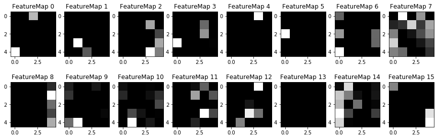

# **Traffic Sign Recognition** 

## Writeup

---

**Build a Traffic Sign Recognition Project**

The goals / steps of this project are the following:
* Load the data set (see below for links to the project data set)
* Explore, summarize and visualize the data set
* Design, train and test a model architecture
* Use the model to make predictions on new images
* Analyze the softmax probabilities of the new images
* Summarize the results with a written report

[//]: # (Image References)

[image1]: ./examples/visualization.jpg "Visualization"
[image2]: ./examples/grayscale.jpg "Grayscaling"
[image3]: ./examples/random_noise.jpg "Random Noise"
[image4]: ./examples/placeholder.png "Traffic Sign 1"
[image5]: ./examples/placeholder.png "Traffic Sign 2"
[image6]: ./examples/placeholder.png "Traffic Sign 3"
[image7]: ./examples/placeholder.png "Traffic Sign 4"
[image8]: ./examples/placeholder.png "Traffic Sign 5"

## Rubric Points
### Here I will consider the [rubric points](https://review.udacity.com/#!/rubrics/481/view) individually and describe how I addressed each point in my implementation.  

---
### Writeup / README

#### 1. Provide a Writeup / README that includes all the rubric points and how you addressed each one. You can submit your writeup as markdown or pdf. You can use this template as a guide for writing the report. The submission includes the project code.

You're reading it! and here is a link to my [project code](https://github.com/JacksonIsaac/udacity-traffic-sign-classifier/blob/master/Traffic_Sign_Classifier.ipynb)

### Data Set Summary & Exploration

#### 1. Provide a basic summary of the data set. In the code, the analysis should be done using python, numpy and/or pandas methods rather than hardcoding results manually.

I used the pandas library to calculate summary statistics of the traffic
signs data set:

* The size of training set is 34799
* The size of the validation set is 4410
* The size of test set is 12630
* The shape of a traffic sign image is (32, 32, 3)
* The number of unique classes/labels in the data set is 43

#### 2. Include an exploratory visualization of the dataset.

Here is an exploratory visualization of the data set. Following is a histogram of distribution of data across different labels.

### Design and Test a Model Architecture

#### 1. Describe how you preprocessed the image data. What techniques were chosen and why did you choose these techniques? Consider including images showing the output of each preprocessing technique. Pre-processing refers to techniques such as converting to grayscale, normalization, etc. (OPTIONAL: As described in the "Stand Out Suggestions" part of the rubric, if you generated additional data for training, describe why you decided to generate additional data, how you generated the data, and provide example images of the additional data. Then describe the characteristics of the augmented training set like number of images in the set, number of images for each class, etc.)

Initially, I tried to use the LeNet as is with the color images. I noticed that the accuracy was very low (<10-15%).

I converted the images to gray-scale so that the model doesn't overfit on colors. I got an improvement and overall accuracy went upto 50%.

Here is an example of a traffic sign image before and after grayscaling.

![Gray Scale Image][image2]

As next step, one can use data augmentation, but I was able to get a good accuracy of about 94% on valiation set by adding dropout and parameter tuning of LeNet. If time permits, I will be adding augmented data to the labels where the samples are less than a threshold (probably less than the mean of samples across the labels).

#### 2. Describe what your final model architecture looks like including model type, layers, layer sizes, connectivity, etc.) Consider including a diagram and/or table describing the final model.

My final model consisted of the following layers:

| Layer         		|     Description	        					| 
|:---------------------:|:---------------------------------------------:| 
| Input         		| 32x32x1 Gray Scale image   							| 
| Convolution 5x5     	| 1x1 stride, same padding, Output: 28x28x6 	|
| RELU					|												|
| Max pooling	      	| 2x2 stride,  outputs 14x14x6 				|
| Convolution 5x5	    | 1x1 stride, same padding, Output: 10x10x16 	|
| RELU					|												|
| Max pooling	      	| 2x2 stride, Output: 5x5x16 				|
| Flatten | Convert 3-D data to 1-D |
| Fully connected		| Input: 400, Output: 120 |
| RELU					|												|
| Dropout	      	| keep_prob: 0.5	|
| Fully connected		| Input: 120, Output: 84 |
| RELU					|												|
| Dropout	      	| keep_prob: 0.75	|
| Fully connected		| Input: 84, Output: 43 |

#### 3. Describe how you trained your model. The discussion can include the type of optimizer, the batch size, number of epochs and any hyperparameters such as learning rate.

To train the model, I used different parameter tuning and adding dropout to the LeNet architecture. I have captured the changes and performance in the below table:

| Architecture | Accuracy (on Valid set) | Hardware | FileName |
| :-: | :-: | :-: | :-: |
| LeNet as is from the Quiz (3 channels) | < 10% | CPU | ./lenet |
| Gray scale with LeNet | ~40%-50% | CPU | ./lenet_grayscale_run1 |
| Add mean and stddev parameters to Weights | ~84% | GPU | ./lenet_grayscale_run2 |
| Re-run above on CPU | 87% | CPU | ./lenet_grayscale_run3 |
| Epoch updated from 10 to 25 | ~87.5% | GPU | ./lenet_grayscale_run4 |
| Add Dropout to FC1 layer | ~92.5% | GPU | ./lenet_grayscale_run5 |
| Add Dropout to FC2 layer | ~90% | GPU | ./lenet_grayscale_run6 |
| Epoch updated from 25 to 50 | ~86.8% | GPU | ./lenet_grayscale_run7 |
| Increase keep_prob by 1.5 for FC2 dropout | ~93-94% | GPU | ./lenet_grayscale_run8 |
| Re-run on CPU | ~93-94% | CPU | ./lenet_grayscale_run9 |

#### 4. Describe the approach taken for finding a solution and getting the validation set accuracy to be at least 0.93. Include in the discussion the results on the training, validation and test sets and where in the code these were calculated. Your approach may have been an iterative process, in which case, outline the steps you took to get to the final solution and why you chose those steps. Perhaps your solution involved an already well known implementation or architecture. In this case, discuss why you think the architecture is suitable for the current problem.

My final model results were:
* Validation set accuracy of 94.1%
* Test set accuracy of 91.3%
* Internet Image test set accuracy of 40% (The images used from internet were resized to 32x32, hence some images were not classified correctly due to data loss on resize)

* What was the first architecture that was tried and why was it chosen?
LeNet was used out of the box from the previous Lab.
* What were some problems with the initial architecture?
It didn't work well with color images. Also the improvements were not much even if epochs were increased. Probably local minima issue. Fixed this by adding dropout to the architecture.
* How was the architecture adjusted and why was it adjusted? Typical adjustments could include choosing a different model architecture, adding or taking away layers (pooling, dropout, convolution, etc), using an activation function or changing the activation function. One common justification for adjusting an architecture would be due to overfitting or underfitting. A high accuracy on the training set but low accuracy on the validation set indicates over fitting; a low accuracy on both sets indicates under fitting.
The model was under fitting initially when used out of the box from previous Lab. Added dropout and increased the number of epochs to achieve better results.
* Which parameters were tuned? How were they adjusted and why?
No of epochs were increased, dropout layer was added, keep_probs was kept 0.5 for 1st FC and 0.75 for 2nd FC. When both FC were 0.5 keep_probs, issue of under fitting arised. The model was dropping the important features and accuracy didn't improve much after few epochs.
* What are some of the important design choices and why were they chosen? For example, why might a convolution layer work well with this problem? How might a dropout layer help with creating a successful model?
Dropout helped in skipping some of the unwanted connections in the FC layers which improved the accuracy further. Probably the model reached local minima or under fitting the data set.
 
### Test a Model on New Images

#### 1. Choose five German traffic signs found on the web and provide them in the report. For each image, discuss what quality or qualities might be difficult to classify.

Here are five German traffic signs that I found on the web:

   

The images used from internet were resized to 32x32, hence some images were not classified correctly due to data loss on resize

#### 2. Discuss the model's predictions on these new traffic signs and compare the results to predicting on the test set. At a minimum, discuss what the predictions were, the accuracy on these new predictions, and compare the accuracy to the accuracy on the test set (OPTIONAL: Discuss the results in more detail as described in the "Stand Out Suggestions" part of the rubric).

Here are the results of the prediction:

| Image			        |     Prediction	        					| 
|:---------------------:|:---------------------------------------------:| 
| Slippery Road      		| Dangerous curve to the right	| 
| Road Work     			| Road Work 										|
| 70 km/h					| 70 km/h											|
| 100 km/h	      		| No passing				 				|
| Pedestrian			| 70 km/h      							|

The model was able to correctly guess 2 of the 5 traffic signs, which gives an accuracy of 40%. This will improve if the input image is cropped to the sign-board and in squared box.

#### 3. Describe how certain the model is when predicting on each of the five new images by looking at the softmax probabilities for each prediction. Provide the top 5 softmax probabilities for each image along with the sign type of each probability. (OPTIONAL: as described in the "Stand Out Suggestions" part of the rubric, visualizations can also be provided such as bar charts)

The code for making predictions on my final model is located in the 63rd (execution number) cell of the Ipython notebook.

For the Road work and speed limit 70kmph image, the model is relatively sure about the label with 0.99 probability.

The top probability for each image is given in below table:

| Probability         	|     Prediction	        					| 
|:---------------------:|:---------------------------------------------:| 
| 0.42      		| Dangerous curve to the right	| 
| 0.99     			| Road Work |
| 0.99					   | 70 km/h |
| 0.98	      	| No passing |
| 0.89			     | 70 km/h |

### (Optional) Visualizing the Neural Network (See Step 4 of the Ipython notebook for more details)
#### 1. Discuss the visual output of your trained network's feature maps. What characteristics did the neural network use to make classifications?

